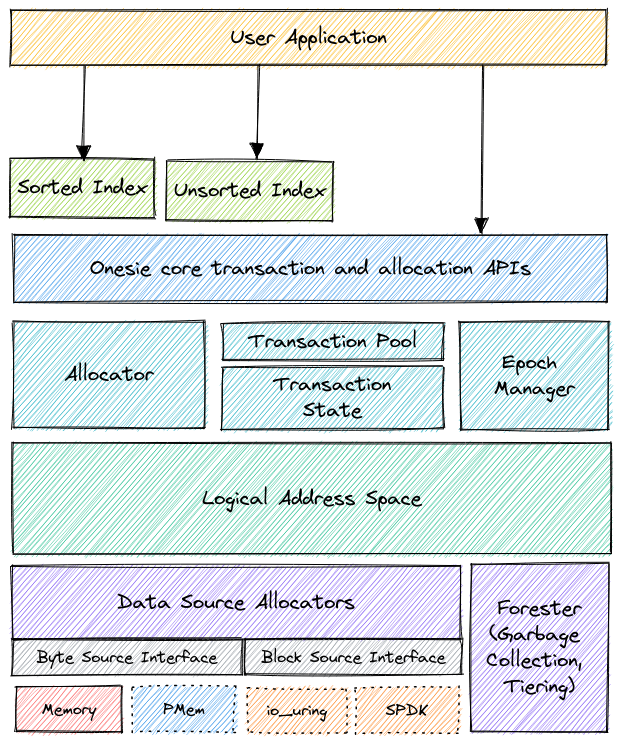
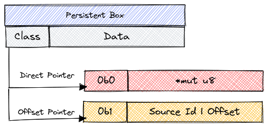
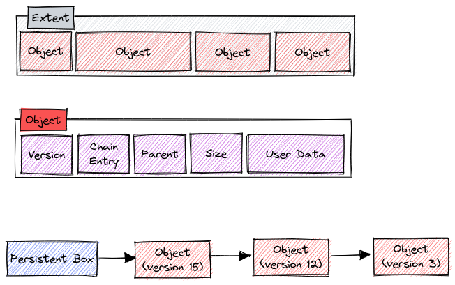
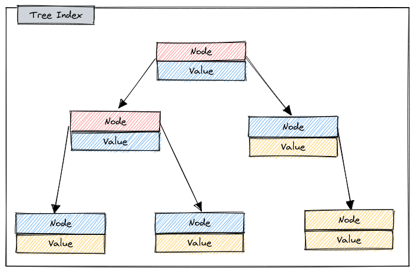
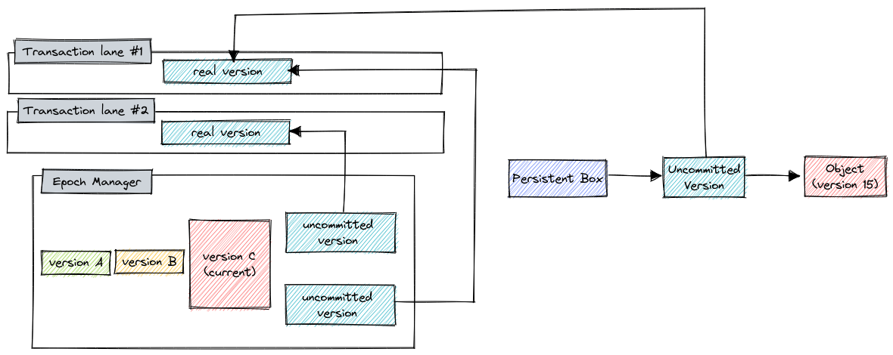
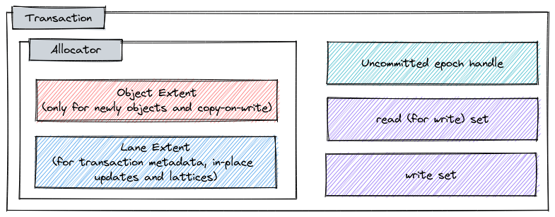

# Onesie - Heterogeneous Heap with Log-Structured Transactions

## Overview

Onesie is a multi-tier heterogeneous persistent heap that supports transactional
operations on arbitrary objects and data structures. Complex indexing
data structures (Trees, Hash Tables) is delegated to an upper layer implementation.
This separation, atypical for storage engines, allows developers
the flexibility to create complex applications without the necessity to delve into the
potentially gnarly details of the underlying data management system.

Onesie is meant to be an unifying abstraction for modern memory and NVMe storage devices,
optimized to scale from small DRAM-only nodes to large heterogeneous platforms with
complex topologies. It's designed to be used both as a simple key-value store
and as a backend for OLAP or OLTP databases.

This solution is motivated by the increasingly convergent nature of memory and
storage, in terms of feature-set, relative performance and the diversity of available
hardware. NVMe-based storage devices are boasting better and better latencies (10< us)
whereas new memory technologies are promising huge capacities (TBs), diverse
performance characteristics and new capabilities like dynamic rack-scale
provisioning or accelerated asynchronous memory operations. To harness this
potential and tame the complexity of complex platforms, programmers will need
object storage abstractions that are familiar yet efficient.

## Key Ideas

### Transparent support for heterogeneous memory and storage

Modern server platforms are converging on heterogeneous architecture, both
in terms of compute and data. And it's important for modern software
stacks to be able to dynamically adapt to that increasingly heterogeneous hardware.
This is well exemplified by PMem, which blends the concepts of secondary storage
and main memory. In the future, CXL promises to enrich this data ecosystem even
further. This trend means that new software solutions must be able to scale from
classical server configurations common today to diverse platforms of tomorrow.

Onesie intends to fill this gap by transparently supporting efficient data
tiering across different memory and storage technologies, making any data
accessible through a single common interface.

### ACID Transactions with flexible ~~asynchronous~~ API

The modern software ecosystem is getting increasingly complex with a diverse
set of requirement on the memory and storage systems. To satisfy those requirements,
and ensure relative ease of use, Onesie implements a well-known abstraction of
ACID transactions, transplanted to low-level systems programming language.
This enables developers to concentrate on what's important instead of having to
deal with intricacies of lock-free data structure design or making workarounds
for inflexible high-level APIs.

The original plan was to also make the transaction API asynchronous - i.e., use
async/await in Rust. Theoretically, this could help eliminate the impedance
mismatch between storage and memory interfaces and also allow Onesie to more
efficiently use memory-to-memory offload. However, early prototypes show
a non-insignificant penalty (~50ns) for simply using async functions in Rust
with a non-trivial runtime (Tokio). This makes async unfeasible for scenarios
where most accesses are to objects located in main memory.

### Low-overhead data access through swizzled pointers

Supporting both block-addressable and byte-addressable data presents a problem
on how to ensure interoperability between objects located on these different
types of media. A traditional approach is to use an indirection layer and
operate on logical addresses. This introduces significant overheads if
we assume that a) a large portion of data is going to be resident in-memory, and
b) that our block-addressable media is very fast (i.e., NVMe). To eliminate this
overhead, Onesie uses the idea of swizzled pointer, which minimizes the data
access overheads at the cost of some design complexity.

### Multi-Version Concurrency Control with serializable snapshot isolation

Onesie uses the common MVCC technique to manage concurrent transactions,
which allows conflict-free transactions (which includes e.g., read-only ones)
to proceed without any synchronization whatsoever. This does mean that there
needs to be a concurrent-safe memory reclamation system to remove inaccessible
versions (e.g., garbage collection). However, such a system is also required
to manage data movement and compaction for large long-running heterogeneous
heaps, so choosing MVCC is complementary with the over-arching design.

### Log Structured Storage

Choosing MVCC also means that the system is essentially copy-on-write. This
has its downsides (e.g., large objects are expensive to modify) and upsides
(concurrency is much easier). To make sure that performing copy-on-write is
as fast as possible, Onesie uses a segmented log-structured data storage,
which means that writing a new object is as simple as appending it to the
end of an active (per-transaction) segment. This makes writes more efficient
for all types of media like PMem or NVMe block devices. And even in the case of
DRAM, where we don't necessarily care about failure atomicity, using logs instead
of traditional dynamic heap implementations, can be beneficial for space
efficiency, latency and throughput. This was demonstrated by prior work in
RAMCloud [0] and FASTER [1]

Existing contemporary designs, such as LSM-Trees or Fractal B-Trees, typically
buffer writes in memory, sort them, and write data in batches. In other words,
these designs trade-off CPU time and memory for more orderly access to the
block device. And as the block device becomes faster, they become more and more
CPU bound [2]. Onesie makes a different trade-off, with the assumption that
modern NVMe block devices are relatively fast, and will only opportunistically
order the data by access frequency. However, higher-level data structures might
opt to sort data by key.

There are also a few added benefits for using log-structured storage. It allows
the system to leverage Zoned Namespaces (ZNS) devices, potentially increasing
performance and reducing cost of a deployed system. It also simplifies the
implementation of features such as snapshotting or asynchronous replication.

### Efficient use of modern hardware and software features

Onesie makes design choices that match the modern hardware and software ecosystem.
From using ZNS-friendly on-media layout to using unified object handles
across all types of media. Onesie is also expected to take advantage of new
platform features when they are present on the platform, such as
Hardware Transactional Memory (HTM) to speed-up in-memory transactions or
Data Streaming Accelerator (DSA) that will enable us to optimize compaction
or data movement.

## User interface



The high level interface exposes memory management interface (alloc/free) and
means of safely reading and writing to existing memory locations (transactions).
At the low-level, objects are simply array of bytes, but a convenience zero-copy
serialization and deserialization interface will also be implemented.

Here's the API from the existing prototype:

```Rust
pub struct PersistentBox<T: Persistent>;

pub struct Writeable<T: Persistent>;
impl<T: Persistent> Deref for Writeable<T>;
impl<T: Persistent> DerefMut for Writeable<T>;

pub struct Readable<T: Persistent>;
impl<T: Persistent> Deref for Readable<T>;

pub struct Upgradeable<T: Persistent>;
impl<T: Persistent> Deref for Upgradeable<T>;

impl Transaction {
    pub fn root_untyped(&self) -> &Untyped;
    pub fn root<T: Persistent + 'static>(&self) -> Result<&PersistentBox<T>>;

    pub async fn read_untyped(&self, pointer: &Untyped, size: ObjectSize) -> Result<UntypedReadable>;
    pub async fn read<T: Persistent + Debug>(&self, pointer: &PersistentBox<T>) -> Result<Readable<T>>;

    pub async fn set(&self, pointer: &Untyped, offset: usize, src: &[u8]) -> Result<UntypedReadable>;

    pub async fn write_untyped(&self, pointer: &Untyped, size: ObjectSize) -> Result<UntypedWriteable>;
    pub async fn write<T: Persistent + Debug>(&self, pointer: &PersistentBox<T>) -> Result<Writeable<T>>;

    pub async fn read_for_write_untyped(&self, pointer: &Untyped, size: ObjectSize) -> Result<UntypedUpgradeable>;
    pub async fn read_for_write<T: Persistent + Debug>(&self, pointer: &PersistentBox<T>) -> Result<Upgradeable<T>>;

    pub async fn upgrade_untyped(&self, src: UntypedUpgradeable) -> Result<UntypedWriteable>;
    pub async fn upgrade<T: Persistent + Debug>(&self, src: Upgradeable<T>) -> Result<Writeable<T>>;

    pub async fn box_is_dangling_untyped(&self, pointer: &Untyped) -> Result<bool>;
    pub async fn box_is_dangling<T: Persistent + Debug>(&self, pointer: &PersistentBox<T>) -> Result<bool>;

    pub async fn alloc_untyped(&self, pointer: &Untyped, size: ObjectSize) -> Result<UntypedWriteable>;
    pub async fn alloc<T: Persistent + Debug>(&self, pointer: &PersistentBox<T>) -> Result<Writeable<T>>;

    pub async fn free_untyped(&self, dest: &Untyped) -> Result<()>;
    pub async fn free<T: Persistent + Debug>(&self, dest: &PersistentBox<T>) -> Result<()>;
}

impl Onesie {
    pub async fn run<R, B, F>(&self, body: B) -> Result<R>
    where
        B: Fn(&'static Transaction) -> F,
        F: Future<Output = Result<R>>;
}
```

Small example:

```rust
struct MyIndex {
    idx: Trie<u32, Value>,
}
let mut builder = Onesie::Builder::new()
    .byte_source(MemorySource::new(memsize)?)
    .pagesize(4096);
if let Some(path) = file {
    builder = builder.block_source(IouringSource::new(&path, filesize)?);
}
let onesie = builder.build()?;
onesie.run(|tx| async move {
    let root = tx.root::<MyIndex>()?;
    let rootp = tx.read(root).await?;
    rootp.idx.insert(&tx, 1234, Value { data: "hello world!" }).await?;

    Ok(())
}).await;
```

The prototype was written using async/await to evaluate feasibility of writing
a fully async object storage system that can transparently use native async
I/O interfaces (e.g., `io_uring`) and memory accelerator (e.g., DSA). For the
prototype implementation, each async operation (like `read` or `write`) on an
object added roughly ~50ns of latency overhead on the test setup. It's
possible that with a custom async runtime implementation that overhead could
be reduced. The new Onesie version will be implemented without async - this will
simplify development and allow us focus on proving the key ideas.

Transactions provide (serializable) isolation and there's no need to use any
locking primitives. They behave like an STM or a database transaction. If the
storage engine is configured with any persistent source, transactions will by
default provide buffered durable linearizability [3], with option to wait
for durability (ala `msync`). Deployments without low-latency byte-addressable
persistent source will see reduced performance and increased write amplification
if synchronous durable linearizability is enforced.

For best performance, users should be aware of the performance characteristics
of certain operations. To allow safe concurrent synchronization-free read and
write access from multiple threads (which is famously forbidden by Rust's
memory model), acquiring write access to data will create a unique copy of the
transaction. The `set` operation enables fire-grained modification of data inside
of an object without the need to acquire write access. The `set` operation will
merely log an action to modify a memory location and will resolve any conflicts
at commit time.

The `read for write` function is provided for software to avoid write skew issues.

The current design imposes some limitation on data structures used with Onesie:
 - all objects can only have one parent
 - all pointers inside of an object must be at its beginning
 - builtin zero-copy serialization requires that structs implement the Persistent
 trait. This enforces that objects must be trivially copyable and have stable
 API representation.

## Logical Address Space and Page Allocation

The heap is composed of I/O sources. The source abstraction is an asynchronous
I/O interface that can be implemented for block-based or byte-addressable devices.
Each source also indicates whether it's persistent or not, i.e., if it retains its
contents across restarts/crashes. This allows the source abstraction to be used
to express an asynchronous interface to a wide variety of contemporary devices,
such as regular DRAM, PMEM, SSDs or even network storage. The source interface
does not assume presence of the file system, which enables it to be used in
conjunction with user-space I/O interfaces like those provided in SPDK.
Memory-like sources also have no requirements with regards to the underlying
page size, and the storage engine won't do anything that might break apart pages,
like mmap-based defragmentation. This is to allow the use of huge pages to
reduce TLB misses - which is required to support large capacities of memory.

Each source has a unique identifier in the heap. To enable heap growth, new sources
can be added at runtime, but sources can also be written such that they transparently
expand on write (like sparse files).

Data in sources is organized in pages and extents. Extents can span multiple pages.
Allocations within a an extents are organized into logical slices. Trying to
translate a logical slice that crosses an extent boundary will result in a runtime failure.

The heap gives out mutable references (&mut [u8]) to extents exactly once:
on allocation. Allocations need to be published for a Logical Slice to be created.
Such a slice can then be optionally divided into smaller pieces and used in
the read method. This enforces the invariant that there's only one live mutable
reference for a single memory location, guaranteeing no data races.

The heap interface always allocates byte addressable storage, with preference
for persistent memory if allocation is meant for a new object inside of a transaction.
If a new object is written to a byte-addressable storage that is not persistent,
the heap will allocate a block-based page to asynchronously transfer the data.

The mapping between in-memory extents and block storage extents is stored in
a page table. However, this page table only contains the mapping between
two logical slices. There's no indirection layer in the form of Page ID or similar.
This means that internal references cannot be based on stable Page ID information.
Instead, Onesie employs pointer swizzling [4].

## Swizzled Pointers



Because Onesie is meant to work efficiently with both byte-addressable memory
and block-based storage, it cannot use traditional database techniques that
involve a page table lookup every time an internal reference is retrieved.
This would significantly hamper performance of in-memory operations. Instead
Onesie uses a swizzled pointer type that changes its internal representation
based on what type of storage it's pointing to.

Volatile byte-addressable storage uses normal pointers. Persistent byte-addressable
and block addressable storage use offset pointers. Dereferencing such a pointer
for PMem source is as simple as adding the offset to the base address of the source,
whereas dereferencing a pointer to block storage involves creating a new
byte-addressable page and populating it with the content from the block storage.
On dereferencing, offset pointers to block storage are swizzled in-place.

## Object Layout



Users manage object allocation at an object level. One extent can have one or more
objects. Onesie uses new-to-old ordering of object versions.
Each object contains version, a chain entry for the intrusive list of version,
a parent pointer, size of the object and user data.

Versions are used to determine which object to return for a transaction.
Chain entry is used to add and remove versions for the object.
Parent pointer is used during unswizzling.

Objects are valid if they have a non-zero (uncommitted) version.

## Replacement Policy



When byte-addressable memory is available the entire workload resides in memory,
with on-storage persistent backing if required. Once the workload grows beyond
available memory, replacement policy kicks in. The LAS keeps a map of dynamically
adapting number of extents for each source allocator, ready to be evicted.
This map is called eviction candidate map. All extents on that map have their
pointers unswizzled, which, for in-memory extents, forces all reads to take the
slow path through the LAS read function. If such a read happens, the extent is
removed from the candidate map and immediately given back to the reading thread.
The removed candidate is then replaced by another extent. 

The initial implementation of the selection algorithm is random with second chance.
This process also makes sure to never evict pages that are a part of an active
transaction.

The goal of the replacement policy is to pretty much stay out of the way.
Readers should pay a minimal cost when the hot working set comfortably
fits in the available byte-addressable memory.

TODO: object-level replacement policy. I made some experiments, but didn't zero
in on a sensible design that minimizes the costs on the in-memory path.

## In-place updates

LAS assumes that no pages/extents that have an existing storage backing are ever
dirty, and so, during reuse of memory extents, the in-memory data is not flushed to
backing storage. This is to avoid any potentially expensive operations on the
memory allocation path. This assumption of no dirty pages disallows any in-place
updates of existing extents, which could be detrimental for performance. In the common
case, most changes should happen through copy-on-write.

Pointer updates are a special case, and they always happen immediately in the
transaction and in-place. This is safe because pointer reads always happen
through an indirection layer that can select the appropriate object pointer
to return for a given transaction.

To allow other in-place updates, transactions maintain a versioned redo (delta) log.
Since Onesie is an MVCC system, in-place updates cannot be performed directly.
Instead, the system maintains a list of pending redo entries and
tries to opportunistically merge and apply them to objects that are not
part of any active transaction or snapshot, updating the version.
If that cannot be accomplished because of a snapshot, eventually a background
task will be spawned to asynchronously create new objects with the updates
applied. New transaction will stall if there are pending redo log entries
and running transactions that need the old versions of relevant objects.

## Compacting Garbage Collection

Onesie uses a continuously running compacting garbage collection system that 
tracks versions at an object level [5]. Objects that are not part of any
snapshot and are not reachable from any active transaction are
transparently pruned.

Extent occupancy is tracked locally by the GC thread. Once sufficient
space is available, multiple extents are compacted. This requires that
all pointers into the moved objects are updated. Once that's done, the
freed extents are moved into the eviction candidate map for eventual
deallocation.

## Epoch Manager



Epoch manager keeps track of the latest version of the system, and allocates
new versions to requesting threads. Initially, versions start at 1, and grow
monotonically. On recovery, the latest committed version is retrieved
from last transaction metadata.
Version 0 is reserved for uncommitted transactions.

## Versions

There are two types of version handles. Real versions that internally
contain an actual version number, and indirect versions that point to the
real version.
All new objects allocated inside of a transaction start with indirect versions
that point to an uncommitted version inside of the transaction state.

## Transactions



Transactions are built on top of the functionality provided by the heap and are MVCC.
The six fundamental operations are: alloc, free, read, write, read-for-write, and set.
Alloc and free take a reference to the pointer on which to perform the operation.
Pointers are not `Copy` from the user perspective, meaning that once an
allocation is created, it cannot be moved to a different pointer. This ensures
that there's always only one parent for a pointer.

Transactions always acquire a version number.

The first non-read operation acquires an allocator and allocates a new
initially zeroed write version. This makes the transaction a write transaction.
The first alloc or write operation acquires an Object Allocator. Per-transaction
allocator provides some degree of allocation scalability.

New allocations (be it from alloc or write) atomically update
the in-memory pointer they operate on to point to a newly allocated object
with an uncommitted indirect version.
If the target pointer contains an object with uncommitted version, the
transaction aborts to avoid a write conflict.

Reads always proceed uncontested, simply checking the version chain to make
sure that the correct (equal or smaller then the transaction version) object
version is used.

Read for write prevents other potential writers from creating a new version
of the object. For example, in a tree data structure, if one thread updates
the root node while another thread is inserting a leaf, the leaf might get
lost if read-for-write is not used.

The described transactional system guarantees conflict- and synchronization-
free commits for most transactions.
To commit, read transactions are marked as inactive in the global pool, while
write transactions update their versions from uncommitted to the transaction
version id. This makes all the previously created objects committed.
Both types of commit only require a single atomic store to update the real
version inside of the transaction state. All objects allocated within that
particular transaction will have their indirect versions updated to the
real version numbers in background. Once all indirect versions associated with
the given committed transaction state are updated, the transaction state is
discarded for reuse.

## Lattices

A lattice is logically an object containing some value T and a merge
operator Fn(T, T) -> T. The merge operator needs to be persistent, or at least
must be available during recovery. Otherwise, any conflicts would have to be
resolved at commit time, and the actual merged value would have to be written
in the log, instead of the entire lattice. This would create codependent
transactions. Right now, I'm leaning towards an interface where lattice types
would have to be registered when a Onesie instance is being opened. Then, if
there's a log with a lattice modification, but the merge operator is not
registered, the open would fail.

## Tiny object optimization

Having a large header associated with an object means that space amplification
for tiny objects can become a problem. Header-less objects, or unversioned objects,
are a special variety of objects that are immutable and must be allocated by
a special slab allocation interface. They do not support read-for-write or
write operations, and they cannot contain pointers. This is achieved by
a special slab-based extent organization, where the extent is subdivided into
equally sized objects, with a header that consists of class size information
and a bitmap. All slabs must be registered at runtime by the application.

TODO: explicit slabs might be too bothersome to use. Consider using slotted
extent structure to support both small overhead and transparent
compacting, removing the need for slabs.

## References

[0] - https://dl.acm.org/doi/10.1145/2806887

[1] - https://microsoft.github.io/FASTER/

[2] - https://dl.acm.org/doi/10.1145/3341301.3359628

[3] - https://www.cs.rochester.edu/u/scott/papers/2016_DISC_persistence.pdf

[4] - https://db.in.tum.de/~leis/papers/leanstore.pdf?lang=en

[5] - https://15721.courses.cs.cmu.edu/spring2020/papers/05-mvcc3/p128-bottcher.pdf
